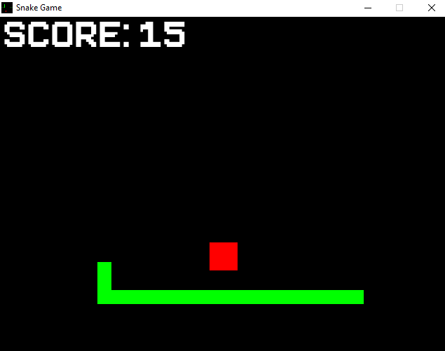
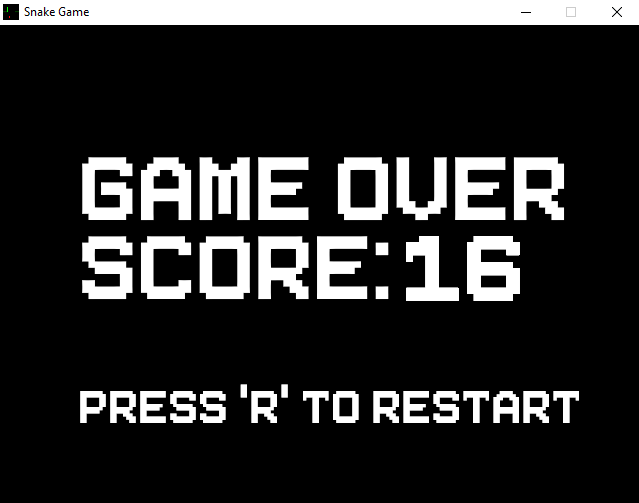
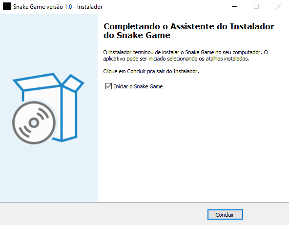

# Snake Game em Python

## Introdução
### Boa tarde queridos desenvolvedores, hoje lhes trago um Snake Game totalmente feito em python e ele é exclusivo pra Windows. Mais uma vez usei a biblioteca do Pygame para fazê-lo, além do Pyinstaller pra gerar o executável e algumas libs nativas pra preservar o carregamento dos arquivos.

## Gameplay
### Uma mecânica bem simples, a cobra se movimenta sozinha e o usuário só escolhe a direção do movimento pelas setas do teclado. Toda vez que a cobra acerta a maça, ela aumenta de tamanho, a pontuação cresce e a maça muda de posição. A cobra bate na parede e aparece na parede oposta, ou ela pode bater em si mesma e abrir a tela de gameover.

    

## Gameover
### A tela mostra a pontuação do jogador, mas também uma mensagem sinalizando uma tecla chamada 'R' que reinicia o jogo e ela pode ser pressionada durante a movimentação da cobra, você decide.

    

## Instalador
### Dessa vez, consegui gerar um executável python com a ferramenta Pyinstaller e criei um instalador para este jogo usando o Inno Setup, é só consultar o arquivo 'SnakeGameSetup.exe' nos arquivos desse repositório.

    

## Ferramentas e Materiais de Apoio
- ### https://www.pygame.org/wiki/about
- ### https://pyinstaller.org/en/stable/
- ### https://en.wikipedia.org/wiki/Inno_Setup
- ### https://youtu.be/eNEvnMOnSFg?si=GnMkY7Kqn7FWguGG
- ### https://youtu.be/5U-nBAfbSek?si=ldp8tR-isLoSxMPW
